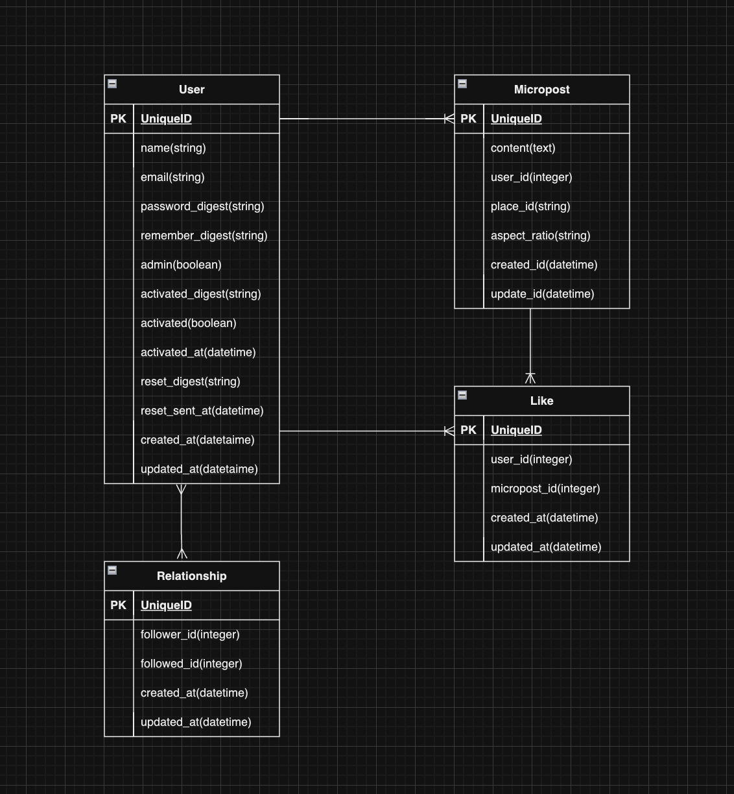
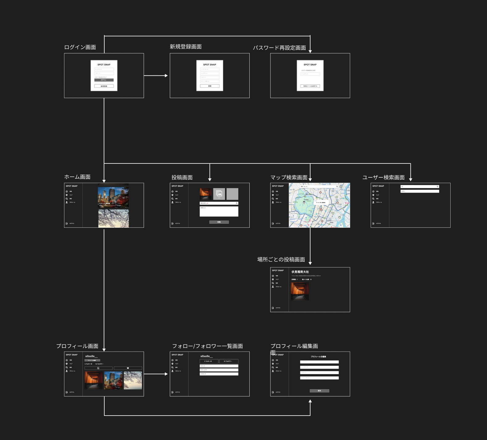

# SpotSnapとは？

## 目次
- [SpotSnapとは？](#spotsnapとは)
  - [サービスURL](#サービスurl)
  - [サービス概要](#サービス概要)
  - [コンセプト](#コンセプト)
  - [ユーザー層](#ユーザー層)
  - [実装機能](#実装機能)
- [設計書](#設計書)
  - [ER図](#er図)
  - [画面遷移図](#画面遷移図)
- [開発環境](#開発環境)

## SpotSnapとは？

### サービスURL
https://spotsnap-app.com

### サービス概要
SpotSnapは、ユーザーが自分のお気に入りの場所を写真付きで投稿し、他のユーザーと共有することができるソーシャルメディアプラットフォームです。ユーザーは他の人の投稿を閲覧したり、地図を使って特定の場所を検索したり、他のユーザーをフォローして交流を深めることができます。

### コンセプト
SpotSnapのコンセプトは、「お気に入りの場所をシェアして、世界中の人々とつながること」です。ユーザーは自分の好きな場所を写真と共に投稿し、他のユーザーと共有することで、新しい場所を発見したり、共通の趣味を持つ人々とつながることができます。また、地図機能を活用して、特定の場所を簡単に検索し、詳細情報を確認することができます。

### ユーザー層
SpotSnapの主なユーザー層は、以下のような人々です。
- 旅行先で人気の観光地を知りたい人「新しい場所を発見し、他の旅行者と情報を共有したい。」
- 自分のお気に入りの場所を共有したい人「美しい風景や特別な場所の写真を撮影し、他の人々と共有したい。」
- 地元のスポットを模索したい人「地元にいても気づかなかった隠れ家スポットを見つけたい。」

### 実装機能
- アカウント登録機能
- ログイン機能
- メール認証機能
- マイページ
- 投稿機能
- いいね機能
- フォロー機能
- ユーザー検索
- 投稿の地図表示機能
- 地図検索機能
- アカウント削除機能
- パスワードリセット機能
- 管理者機能（ユーザー削除）

## 設計書
### ER図

 

### 画面遷移図

 

https://www.figma.com/design/24geQAQ7M3fw5KxlOB68aD/Untitled?node-id=0-1&t=WnkvDUZmMRHQPR8M-1

## 開発環境

| カテゴリ       | 使用技術                                                                 |
| -------------- | ------------------------------------------------------------------------ |
| フロントエンド | JavaScript                                                               |
| バックエンド   | Ruby   Ruby on Rails                                                  |
| データベース   | PostgreSQL                                                               |
| インフラ       | AWS (ECR, ECS, RDS, SES, S3, Route53, EC2)                               |
| テスト         | GitHub Actions (CI)                                                      |
| API            | Geocoding API   Maps JavaScript API   Geolocation API   Places API |
| その他         | Docker   Bootstrap   Cursor                                        |